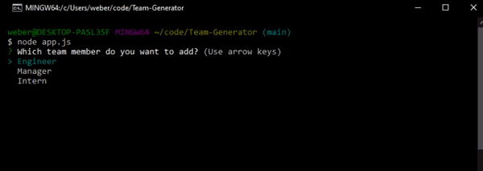

# Team-Generator


## Description

A simple app that generates a team site based on entered members. Each team member has some specific info attached to them and the end result is laid out logically in a nice looking website. Output is found in output folder, and page displays appropriately at all screen widths.




## Table of Contents
1. [Installation](#Installation)
2. [Usage](#Usage)
3. [License](#License)
4. [Questions](#Questions)

## Installation
To install dependencies run the following command:
```
npm install
```

## Usage
install dependencies, then run index.js from node. Answer the questions and when you are done site is generated.

## License
This project is licensed under the MIT license

## Questions
https://github.com/webermg

matthew.gerald.weber@gmail.com
